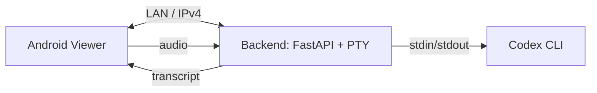

<p align="center">
  
</p>

<h1 align="center">Codex Speech</h1>
<p align="center">Native Android viewer + local backend for controlling the Codex CLI over your LAN.</p>

<p align="center">
  <a href="https://github.com/meinzeug/codex-speech/releases"></a>
  <a href="LICENSE"></a>
  <a href="#android-viewer"></a>
  <a href="#backend"></a>
  <a href="#linux-gui"></a>
</p>

<p align="center">
  <a href="#quick-start">Quick Start</a> |
  <a href="#android-viewer">Android Viewer</a> |
  <a href="#backend">Backend</a> |
  <a href="#linux-gui">Linux GUI</a> |
  <a href="#troubleshooting">Troubleshooting</a>
</p>

---

## Overview
Codex Speech lets you run the Codex CLI on your PC and control it from a native Android app over IPv4. The Android viewer streams a real terminal (no WebView) and offers push-to-talk speech-to-text with optional auto-send. A separate Linux GUI remains available for desktop usage.

**Android App ID:** `com.meinzeug.codexspeech.viewer`

---

## Highlights
- Native Android viewer (Compose + Termux terminal-view)
- FastAPI backend with PTY-attached Codex session
- Faster-whisper STT on the backend
- Two STT modes: insert-only and auto-send
- Directory manager with create/rename/delete
- Server profiles and per-session working directory
- One-line installer for backend + Android APK
- React Native / Flutter hot-runner (Metro + `flutter run`)
- Android MCP auto-registered for device automation
- Distinct app icons for Viewer and Runner

---

## Architecture
<p align="center">
  
</p>



---

## Repo Layout
```
apps/
  android-viewer/   Native Android viewer
  android-runner/   Dedicated runner APK (separate app)
  backend/          FastAPI WebSocket + STT server
  linux-gui-py/     Original Linux GUI (GTK4 + VTE + Vosk)
```

---

## Quick Start
One-line install (backend + Android viewer). The installer will prompt for components when a TTY is available:
```
curl -fsSL https://raw.githubusercontent.com/meinzeug/codex-speech/main/install.sh | bash -s -- ~/codex-speech
```

What it does:
- Installs system deps (Java, Node/PM2, Android SDK tools, ADB)
- Sets up backend venv and starts it via PM2
- Builds the Android viewer + runner APKs
- Installs the APK to a connected device

Optional Linux GUI install:
```
CODEX_SPEECH_INSTALL_GUI=1 \
  curl -fsSL https://raw.githubusercontent.com/meinzeug/codex-speech/main/install.sh | bash -s -- ~/codex-speech
```

Install only specific APKs:
```
CODEX_SPEECH_APK_TARGETS=viewer \
  curl -fsSL https://raw.githubusercontent.com/meinzeug/codex-speech/main/install.sh | bash -s -- ~/codex-speech
```

---

## Android Viewer
Build manually:
```
./apps/android-viewer/gradle-8.5/bin/gradle -p apps/android-viewer :app:assembleDebug
```

Install to device:
```
adb install -r apps/android-viewer/app/build/outputs/apk/debug/app-debug.apk
```

Runner APK (optional):
```
./apps/android-viewer/gradle-8.5/bin/gradle -p apps/android-runner :app:assembleDebug
adb install -r apps/android-runner/app/build/outputs/apk/debug/app-debug.apk
```

Connect flow:
1. Ensure PC and phone are on the same Wi-Fi.
2. Find your PC IPv4 address.
3. Enter IP + port `8000` in the Android app.
4. Optional: select a working directory.
5. Tap **Connect**.

STT modes:
- **Record**: transcribe and insert into input, no auto-send.
- **Mic**: transcribe and auto-send to terminal.

---

## Runner (React Native / Flutter)
If your working directory contains a React Native or Flutter project, the **Runner** section can:
- Detect the project type.
- Start Metro + `react-native run-android` (RN) or `flutter run` (Flutter).
- Use **ADB mode** (USB or wireless ADB) for no‑Wi‑Fi hot reload.
- Trigger Flutter hot reload / hot restart.
- Open the React Native Dev Menu.

Notes:
- For React Native in **LAN/VPN mode**, set “Debug server host & port” in the Dev Menu to your PC IP + Metro port.
- For Flutter, hot reload triggers via the running `flutter run` session.
 - The Runner panel can also **Set Debug Host** automatically for RN debug builds.

---

## MCP (Android Automation)
The installer registers **the-android-mcp** in `~/.codex/config.toml`. This lets Codex control the connected Android device (screenshots, taps, input) via MCP.

---

## Backend
Manual run:
```
python3 -m venv apps/backend/.venv
apps/backend/.venv/bin/pip install -r apps/backend/requirements.txt
apps/backend/.venv/bin/uvicorn main:app --host 0.0.0.0 --port 8000
```

PM2 run:
```
pm2 start ecosystem.config.js --only codex-backend
pm2 logs codex-backend
```

STT configuration:
- `STT_MODEL` (default `small`)
- `STT_DEVICE` (default `cpu`)
- `STT_COMPUTE_TYPE` (default `int8`)

Example:
```
STT_MODEL=medium STT_DEVICE=cuda STT_COMPUTE_TYPE=int8_float16 pm2 restart codex-backend --update-env
```

---

## Linux GUI
The original desktop app is preserved.
```
cd apps/linux-gui-py
python3 -m venv venv
source venv/bin/activate
pip install -r requirements.txt
python3 src/main.py
```

---

## Firewall
Allow inbound TCP 8000 on your LAN (UFW example):
```
sudo ufw allow 8000/tcp
sudo ufw allow from 192.168.0.0/16 to any port 8000 proto tcp
```

---

## Troubleshooting
- App can't connect: check IP, firewall, backend listens on `0.0.0.0:8000`.
- ADB device missing: enable USB debugging and authorize the PC.
- Codex not found: set `CODEX_PATH` or `CODEX_CMD` in backend env.

---

## License
MIT
